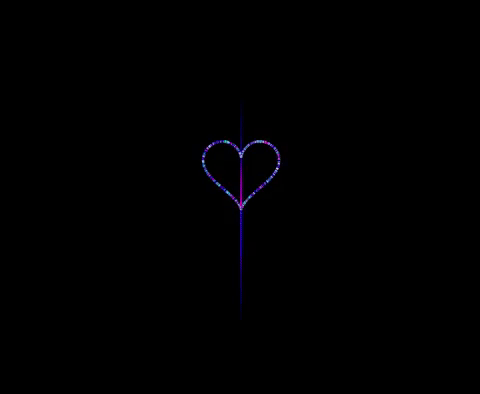
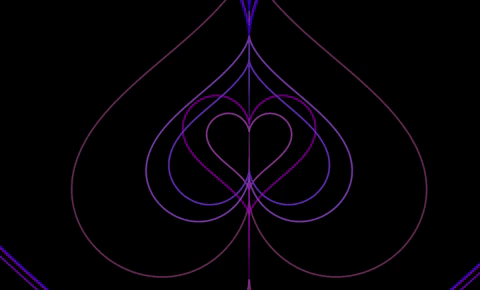

======
Hearts
======

A formula for drawing hearts was found here_.
Sketches were made with reference to the `Nannou documentation examples`_.

Sparkly Hearts
--------------

Expanding Hearts
----------------

Chaotic Hearts
--------------

.. _here: https://editor.p5js.org/codingtrain/sketches/egvieHyt0
.. _Nannou documentation examples: https://github.com/nannou-org/nannou/tree/master/examples
